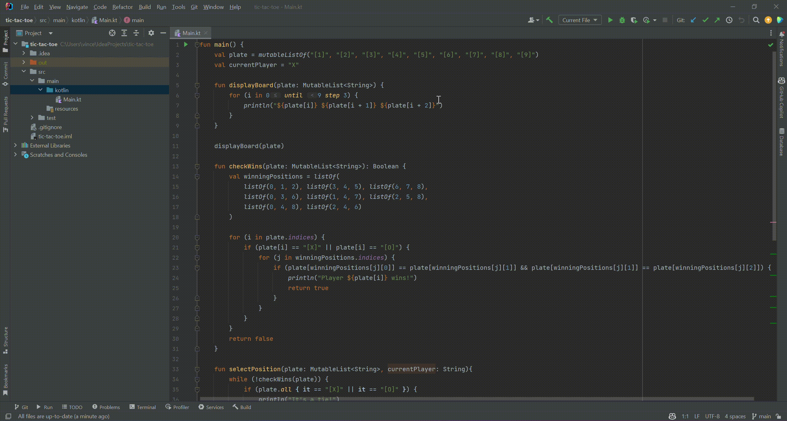

# Tic Tac Toe kotlin
Ce projet est une implémentation simple du jeu Tic Tac Toe (Morpion) en utilisant le langage de programmation Kotlin. Le jeu est joué sur une grille de 3x3 où deux joueurs, X et O, s'affrontent pour aligner trois symboles identiques soit horizontalement, verticalement ou en diagonale.

## Comment lancer le jeu
Assurez-vous d'avoir Kotlin installé sur votre système. Si ce n'est pas le cas, vous pouvez le télécharger à partir du site officiel de Kotlin.

Clonez ce repository Git sur votre machine locale en utilisant la commande suivante :

Copy code
```python
git clone https://github.com/grmvcnt/tic-tac-toe-kotlin.git
```
Accédez au répertoire du projet :

bash
Copy code
cd tic-tac-toe
Compilez et exécutez le jeu

## Exemple d'utilisation
Voici un exemple d'utilisation du jeu Tic Tac Toe :


## Contribuer
Les contributions à ce projet sont les bienvenues. Si vous souhaitez proposer des améliorations, des corrections de bugs ou de nouvelles fonctionnalités, n'hésitez pas à créer une issue ou à envoyer une pull request.

J'espère que vous apprécierez jouer à ce jeu Tic Tac Toe en Kotlin ! Si vous avez des questions ou des commentaires, n'hésitez pas à les partager. Bon jeu !
